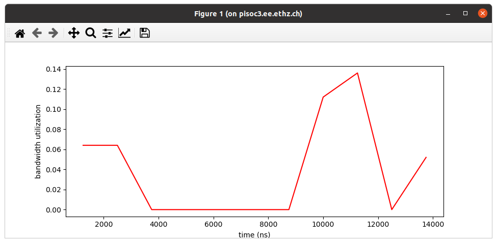
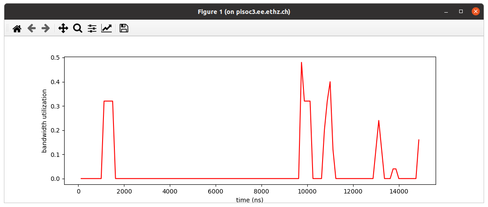

# DRAMSys co-simulation

DRAMSys is a DRAM simulation and analyze tool writing in SystemC. Here we co-simulate MemPool with DRAMSys.

## Structure

- `DRAMSys` is the DRAMSys repo as a submodule to MemPool
- `Patch` contains modification patch on DRAMSys
- `Patch` contains python script to show DRAM analyze results
- `src` contains important source files for co-simulation

## Getting Start

Make sure you have already:
- initilazed MemPool repo
- located at the root folder of MemPool repo.
- compiled some applications from `software/app`

### Initialize DRAMSys

Start executing these commands below:

```bash
make verilator_dramsys
cd hardware
make dramsys_init && make dramsys_compile
```

### Run DRAMSys Co-simulation

Supposing you're at the `hardware` folder, execute the commands below to run simulation

```bash
app=hello_world dram=ddr3 make dramsys_sim
```

Where `app` is the name of your compiled application, and `dram` states the type of DRAM. right now the supported dram types are:
- ddr3
- ddr4
- lpddr4
- hbm2

### Show Simulation Results

After simulation, the performance of DRAM will be shown on the console, including `bandwidth` and `power` (Noting that power analysis on works on `ddr3` and `ddr4`). Meanwhile, a database file `xxx.tdb` will be dumpped out under `dramsys/build/main_program/simulator` folder 

Using our python script to show the DRAM `bandwidth` and `power` fluctuation with time
```bash
python3 dramsys/scripts/dramsys_plot.py  dramsys/build/main_program/simulator/xxx.tdb
```

## Modification 

### MemPool System

The new construction of MemPool System connecting to DRAM is `dramsys/src/mempool_system_to_dram.sv`
The top-level for co-simulation is `dramsys/src/mempool_dramsys_tb.sv`

If you want to modifiy the MemPool System level construction, please feel free to change `dramsys/src/mempool_system_to_dram.sv` while keeping its interface, especially the AXI4 port to DRAM, and do not modify the `dramsys/src/mempool_dramsys_tb.sv`. 

### DRAMSys Simulation Parameters

For each type of DRAM, DRAMSys defines their simulation parameters in json files under folder `dramsys/DRAMSys/DRAMSys/library/resources/config/simulator`. For example, you can modify the parameter `WindowSize` from 1000 to 100, and the final results will have higher sample rates to record DRAM metrics.

window size = 1000


window size = 100


